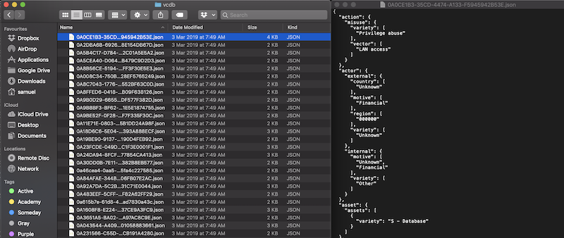

# Data Science for Cybersecurity

## Description
#### Bandung Session
- Title: Data Science for Cybersecurity
- Date: Saturday, **April 13th** 2019  
- Time: 1300 - 1600  
- Venue: Institute of Technology, Bandung (ITB) 
- Instructors: 
    - [Tiara Dwiputri](https://github.com/tiaradwiputri)
    - [Samuel Chan](https://id.linkedin.com/in/chansamuel)  
- Co-organizers: Mathematics club of ITB

#### Jakarta Session
- Date: Tuesday, **April 30th** 2019  
- Time: 1300 - 1600  
- Venue: Prasetiya Mulya University, Jakarta  
- Lead Instructor: [Samuel Chan](https://id.linkedin.com/in/chansamuel)  
- Co-organizers: Prasetiya Mulya University

### Syllabus

The workshop offers an introduction to exploratory data analysis in R through the lens of a cybersecurity research firm. In the 3-hour session, participants will learn about the various EDA tools and visualization techniques to dig deep into cybercrime trends and make the most out of what this rich statistical computing environment has to offer.

Corporate consultant and course producer Samuel Chan has worked for a number of public-listed company prior to his role at Algoritma. His involvement has always heavily centered around product development, from building chatbots for companies to developing cloud-based products. In this workshop, he will walk us through his favorite tools, workflow, and productivity tips:

- A primer on networking  
- Cyber crimes and data breaches  
- Security incidents recording  
- Using R to visualize cybercrime trends  
- Using R for exploratory data analysis on cybercrime  
- Using [`verisr2`](https://github.com/onlyphantom/verisr2)
- Building cyber security dashboards with R  

--- 
## Credits
The dataset for ZeuS Botnet blocklist: http://zeustracker.abuse.ch

The assets (badge, images and other intellectual property) is taken from [Algoritma Data Science Education Center](https://algorit.ma) with permission. 

The work is sponsored by: 
- Algoritma, a data science education center on a mission to democratize world-class education, helping professionals to gain proficiency in machine learning and data visualization by building with real-world projects.

## Screenshot

